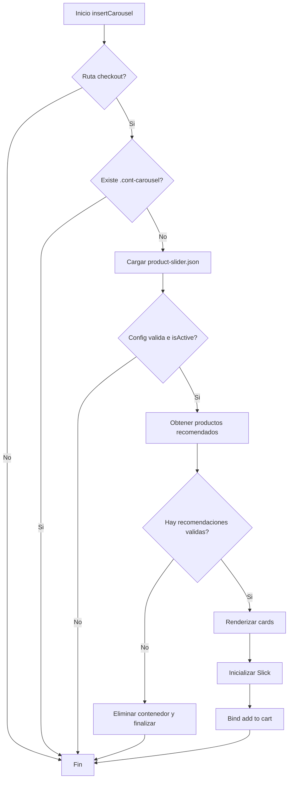

# insertCarousel: Documentacion tecnica detallada

## Objetivo

Describir punto por punto que hace cada funcion de insertCarousel y como fluye el proceso completo del slider en checkout.

## Archivo

- checkout-ui-custom/checkout6-custom.js

## Vision general

insertCarousel controla todo el ciclo del componente:

- valida contexto de checkout
- obtiene configuracion
- consulta recomendaciones de accesorios
- renderiza cards
- inicializa Slick
- conecta el evento de agregar al carrito

## Funcion principal: insertCarousel

### Que hace paso por paso

1. Valida ruta: solo continua si la URL corresponde a checkout.
2. Evita duplicados: si ya existe .cont-carousel, termina.
3. Carga configuracion desde /files/product-slider.json.
4. Si la config no existe o isActive es false, termina.
5. Calcula safeMaxItems a partir de collectionMaxItems con fallback 15.
6. Define utilidades internas de datos, render y eventos.
7. Obtiene productos recomendados (solo accesorios).
8. Inserta el contenedor del slider en el DOM.
9. Genera HTML de cards en memoria y lo inyecta una sola vez.
10. Si no hay cards validas, elimina el contenedor y termina.
11. Inicializa Slick con configuracion responsive.
12. Activa el binding delegado de agregar al carrito.

## Funciones internas de insertCarousel

### escapeHtml(value)

Responsabilidad:

- Sanitizar texto dinamico antes de insertarlo en HTML armado por template strings.

Punto por punto:

1. Convierte el valor a string seguro.
2. Escapa ampersand (&) para evitar entidades invalidas.
3. Escapa menor y mayor (< >) para bloquear etiquetas embebidas.
4. Escapa comillas dobles para proteger atributos HTML.
5. Escapa comillas simples para proteger atributos y texto.

Donde se usa:

- nombre del producto
- marca
- texto de options de talla
- atributos en la card (como alt y src)

### uniqueByProductId(items)

Responsabilidad:

- Eliminar productos repetidos en la lista final de recomendaciones.

Punto por punto:

1. Crea un Set para ids vistos.
2. Recorre cada producto.
3. Si no tiene productId, lo descarta.
4. Si productId ya existe en Set, lo descarta.
5. Si es nuevo, lo agrega al Set y lo mantiene.

### getRecommendedProducts()

Responsabilidad:

- Consultar cross-selling de accesorios para los productos del carrito.

Punto por punto:

1. Lee orderForm con vtexjs.checkout.getOrderForm().
2. Extrae productId de cada item.
3. Elimina ids vacios y duplicados.
4. Si no hay ids, retorna arreglo vacio.
5. Ejecuta consultas en paralelo (Promise.all) al endpoint de accesorios.
6. Si una consulta falla, registra error y retorna [] para ese id.
7. Aplana todas las respuestas.
8. Deduplica por productId.
9. Limita la salida por safeMaxItems.

Endpoint usado:

- /api/catalog_system/pub/products/crossselling/${accessoriesType}/${productId}

### getAvailableSkuOptions(productItems)

Responsabilidad:

- Construir opciones de talla/SKU seleccionables para cada card.

Punto por punto:

1. Verifica que productItems sea un arreglo.
2. Recorre cada SKU del producto.
3. Lee seller principal y commertialOffer.
4. Descarta SKU sin stock (AvailableQuantity <= 0).
5. Descarta SKU sin itemId.
6. Construye opcion con itemId y label.
7. Define label por prioridad: Talla, name, Talla unica.
8. Retorna arreglo filtrado sin nulos.

### resolveCarouselPrice(num)

Responsabilidad:

- Formatear precio para mostrarlo consistente en Chile.

Punto por punto:

1. Convierte a numero y trunca decimales.
2. Si el valor no es valido, usa 0.
3. Formatea con Intl.NumberFormat es-CL sin decimales.

### bindAddToCartEvents()

Responsabilidad:

- Manejar el click de Agregar al carro con control de estado y feedback UI.

Punto por punto:

1. Desregistra handlers previos con namespace click.carouselAddToCart.
2. Registra evento delegado sobre el contenedor del carousel.
3. Si el boton ya esta cargando, evita doble accion.
4. Limpia mensajes previos de checkout.
5. Bloquea boton y muestra spinner.
6. Obtiene SKU seleccionado desde .talla-select.
7. Si no hay seleccion, usa data-default-sku.
8. Si no hay SKU final, restaura boton y termina.
9. Arma payload de item para addToCart.
10. Ejecuta vtexjs.checkout.addToCart([item], null, 1).
11. En success muestra toast de exito.
12. En fail muestra toast de error y log de consola.
13. En always restaura estado original del boton.

## Diagrama de flujo

## Configuracion esperada en product-slider.json

- isActive: habilita o deshabilita el componente.
- accessoriesType: tipo de cross-selling a consultar (default accessories).
- collectionMaxItems: maximo de recomendaciones (default 15).

## Limitaciones conocidas

1. Dependencia de estructura VTEX Catalog:
- Si cambian campos como sellers, commertialOffer, itemId o Talla, el render puede fallar o quedar sin opciones.

2. Dependencia de endpoint de cross-selling:
- Si la estrategia de accesorios no devuelve resultados para los items del carrito, no se muestra slider.

3. Dependencia de Slick y jQuery:
- Si slick.min.js o jQuery no estan disponibles, no hay carrusel funcional.

4. Selector de talla oculto:
- El select de SKU esta en display none; no es visible para usuario final y se usa internamente para resolver SKU.

5. Uso de seller fijo en addToCart:
- El payload usa seller: 1. Si la operacion requiere otro seller, podria no reflejar la mejor oferta.

6. Orden de recomendaciones:
- El sistema mantiene el orden devuelto por APIs y la deduplicacion por primer match, no aplica ranking adicional de negocio.

7. Sin reintentos de red:
- Ante fallas de red, solo se loguea error y se continua sin ese bloque de resultados.

8. Render por string HTML:
- Aunque escapeHtml reduce riesgo de inyeccion, la estrategia sigue siendo template-string; una migracion futura a createElement/textContent daria mayor seguridad estructural.
